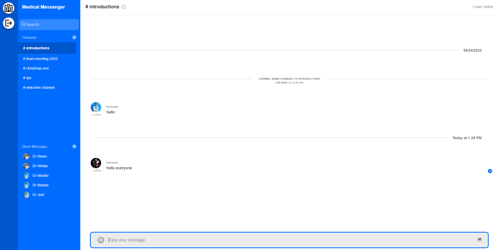
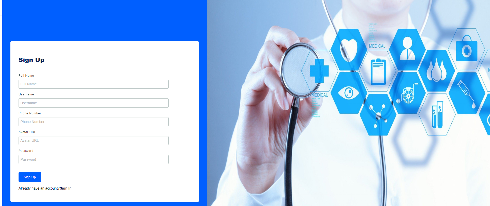
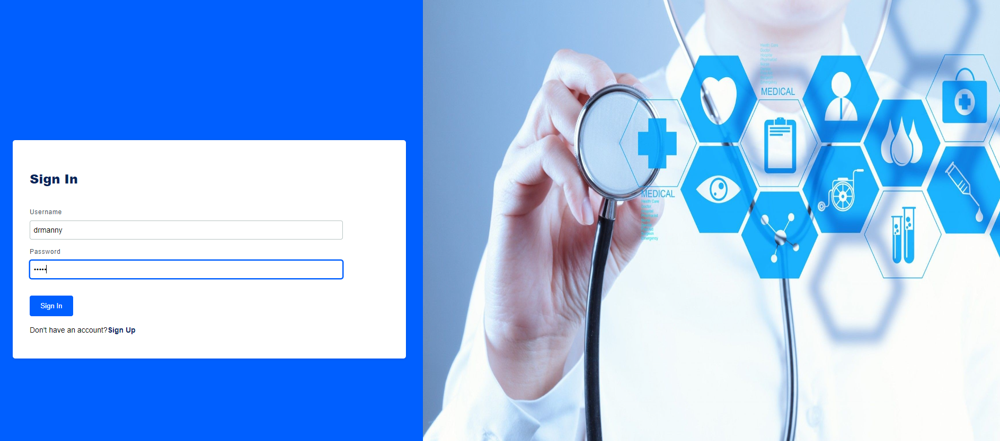

# Medical Chat Messaging App

A simple realtime chat messenger application that allows doctors and other relevant individuals of the field to create and log into an account, where they can create direct messages and team group chats. With doctors being a crucial part of society, it is very important that they have a means of communication among their staff members. This application does just that.

Using backend and frontend functionalities, users can either create an account or log in with an existing account through authentication. This program was created using the Stream Chat API, HTML, CSS, and Javascript (with the use of the React library).

To run the backend server, enter the "backend-server" directory and run the following command "npm run dev".

To run the client server, enter the "client-side" directory and run the following command "npm start".

# References
Adrian Hajdin (https://www.youtube.com/c/JavaScriptMastery)
